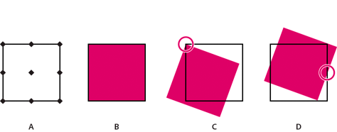

# FXG服务器协议{#fxg-server-protocol}

要处理图形，您可以使用参考点（类似于罗经点）。

使用参考点，您可以相对于某个特定参考点旋转、缩放或调整图形的大小。 参考点为`northWest`、`north`、`northEast`、`west`、`center`、`east`、`southWest`、`south`和`southeast`。 例如，通过使用中心参照点，可以将图形中心旋转45°。 下图显示了参考点所在的位置、图形、图形从其`northWest`参考点旋转20°，以及图形从其`east`参考点旋转20°。

* A.参考点位置
* B. 图形
* C.图形从其`northWest`参考点旋转20°
* D.图形从其`east`参考点旋转20°

语法如下：

`referencePoint <string> (northWest, north, northEast, west, center, east, southWest, south, southEast, none, inherit)`

默认值为none。 `inherit`值将`s7:referencePoint`值（如果它不是`none`）从页面或组级别的顶部传递到所有子级。 `none`设置意味着对象没有参考点，并且使用了FXG坐标系。

>[!NOTE]
>
>要使用参考点，并且该对象在处理之后不包含任何置换，请在处理新该对象之后更新它的 x 和 y 值。

当来自`s7:referencePoint`的值用于组（或路径、行元素或没有显式宽度和高度定义的任何元素）时，该值应用于组的累积定界框。 例如，组中所有对象边界框的左上角用作组的`northWest`参考点；右下角用作`southEast`参考点。
