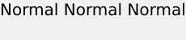
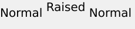
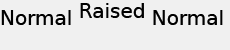

# 文本定位{#text-positioning}

当应用于预定大小的图层时（即，当还指定了size=时），text=渲染器会放置与textPs=渲染器截然不同的文本。

自调整`text=`和`textPs=`层的外观和位置相似。

`textPs=` 将字符单元格的顶部与文本框的顶部对齐(假设为 `\vertalt`)，即使这会导致部分渲染的文本字形在文本框边界之外部分扩展。某些字体的已渲染字形也可能略微突出文本框的左右边缘。 对于要求在图层矩形中包含所有渲染文本的应用程序，可使用RTF `\marg*`命令或`textFlowPath=`来调整文本渲染区域。

相反， `text=`将根据需要移动渲染的文本，并确保所有渲染的字形完全适合指定的文本框。

虽然`text=`对于简单的应用程序可能略为简单，但`textPs=`提供与字体和文本效果无关的精确定位。

## 示例 {#section-1b6bdf2ea34447528188ae4e1430ee71}

以下示例适用于预定大小的文本。 自行调整文本大小的行为不同。

** `Text=`始终在顶部提供窄边距：**

`/is/image/?size=230,50&bgc=f0f0f0&fmt=png&text=\fs40Normal%20Normal%20Normal`

** `textPs=`呈现的文本与文本框顶部紧密对齐，这可能会导致轻微剪切，即使对于常见的字体（如Arial）也是如此：**

`/is/image/?size=230,50&bgc=f0f0f0&fmt=png&textPs=\fs40Normal%20Normal%20Normal`

** `text=`将自动下移呈现的文本以避免剪切：**

`/is/image?size=230,50&bgc=f0f0f0&fmt=png&text=\fs40Normal%20{\up20Raised%20}Normal`

** `textPs=`不会移动包含凸起部分的文本，如果文本位于图层0:**上，则会导致显着剪切

`/is/image?size=230,50&bgc=f0f0f0&fmt=png&textPs=\fs40Normal%20{\up20Raised%20}Normal`

**顶部的10 pt(200 twips)边距可在不进行剪切的情况下呈现此文本：**

`/is/image?size=230,50&bgc=f0f0f0&fmt=png&textPs=\margt200\fs40Normal%20{\up20Raised}%20Normal`

**某些脚本字体的呈现字形可能会显着扩展到文本框外部：**

`/is/image?size=230,50&bgc=f0f0f0&fmt=png&textPs={\fonttbl{\f1\fcharset0%20FluffyFont;}}\f1\fs88%20fluffy%20font%20problems`
