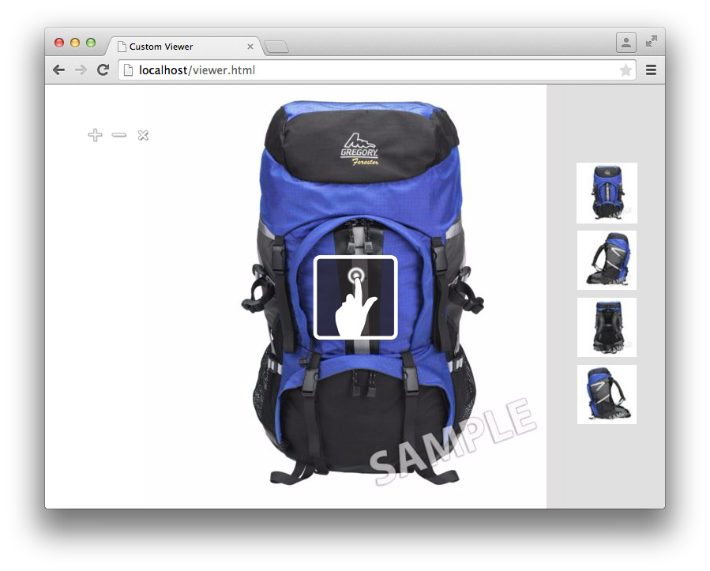

# 查看器SDK教程{#viewer-sdk-tutorial}

Viewer SDK为自定义查看器开发提供一组基于JavaScript的组件。 查看器是基于Web的应用程序，允许将Adobe Dynamic Media提供的富媒体内容嵌入到网页中。

例如，SDK提供交互式缩放和平移。 此外，对于通过名为Dynamic Media Classic的后端应用程序上传到AdobeDynamic Media的资源，它还提供了360度视图和视频播放。

即使组件依赖于HTML5功能，但它们设计为可在Android™和Apple iOS设备以及台式机（包括Internet Explorer及更高版本）上运行。 这种体验意味着您能够为所有受支持的平台提供单个工作流。

SDK由构成查看器内容的UI组件组成。 您可以通过CSS以及具有某种支持角色（如集定义提取以及解析或跟踪）的非UI组件来设置这些组件的样式。 所有组件行为都可以通过修饰符进行自定义，您可以通过多种方式指定修饰符，例如，在URL中指定为`name=value`对。

本教程包括以下任务顺序，以帮助您创建基本的缩放查看器：

* [从Adobe Developer Connection下载最新的查看器SDK](c-tutorial.md#section-84dc74c9d8e24a2380b6cf8fc28d7127)
* [加载查看器SDK](c-tutorial.md#section-98596c276faf4cf79ccf558a9f4432c6)
* [向查看器添加样式](c-tutorial.md#section-3783125360a1425eae5a5a334867cc32)
* [包含容器和ZoomView](c-tutorial.md#section-1a01730663154a508b88cc40c6f35539)
* [正在向查看器添加媒体集和样本组件](c-tutorial.md#section-02b8c21dd842400e83eae2a48ec265b7)
* [向查看器添加按钮](c-tutorial.md#section-1fc334fa0d2b47eb9cdad461725c07be)
* [垂直配置样本](c-tutorial.md#section-91a8829d5b5a4d45a35b7faeb097fcc9)

## 从Adobe Developer Connection下载最新的查看器SDK {#section-84dc74c9d8e24a2380b6cf8fc28d7127}

1. 从Adobe Developer Connection <!-- SDK NO LONGER AVAILABLE TO DOWNLOAD;DOUBLE CHECK WITH AMIT. THIS ENTIRE TOPIC IS LIKELY OBSOLETE. [here](https://marketing.adobe.com/developer/devcenter/scene7/show) -->下载最新的查看器SDK。

   >[!NOTE]
   >
   >您可以完成本教程，而无需下载Viewer SDK包，因为SDK是远程加载的。 但是，查看器包中包含其他示例和API参考指南，可以帮助您创建自己的查看器。

## 加载查看器SDK {#section-98596c276faf4cf79ccf558a9f4432c6}

1. 首先，设置一个新页面来开发您要创建的基本缩放查看器。

   请考虑此新页面，其中包含了用于设置空SDK应用程序的Bootstrap（或加载器）代码。 打开您喜爱的文本编辑器，并在其中粘贴以下HTML标记：

   ```html {.line-numbers}
   <!DOCTYPE html> 
   <html> 
       <head> 
           <meta http-equiv="Content-Type" content="text/html; charset=utf-8" /> 
           <meta name="viewport" content="user-scalable=no, height=device-height, width=device-width, initial-scale=1.0, maximum-scale=1.0"/> 
   
           <!-- Hiding the Safari on iPhone OS UI components --> 
           <meta name="apple-mobile-web-app-capable" content="yes"/> 
           <meta name="apple-mobile-web-app-status-bar-style" content="black"/> 
           <meta name="apple-touch-fullscreen" content="no"/> 
   
           <title>Custom Viewer</title> 
   
           <!-- 
               Include Utils.js before you use any of the SDK components. This file  
               contains SDK utilities and global functions that are used to initialize the viewer and load viewer  
               components. The path to the Utils.js determines which version of the SDK that the viewer uses. You  
               can use a relative path if the viewer is deployed on one of the Adobe Dynamic Media servers and it is served  
               from the same domain. Otherwise, specify a full path to one of Adobe Dynamic Media servers that have the SDK  
               installed.  
           --> 
           <script language="javascript" type="text/javascript"      
                   src="http://s7d1.scene7.com/s7sdk/2.8/js/s7sdk/utils/Utils.js"></script> 
   
       </head> 
       <body> 
           <script language="javascript" type="text/javascript"> 
           </script>  
       </body> 
   </html>
   ```

   将以下JavaScript代码添加到`script`标记中，以初始化`ParameterManager`。 这样做有助于您准备在`initViewer`函数中创建和实例化SDK组件：

   ```javascript {.line-numbers}
   /* We create a self-running anonymous function to encapsulate variable scope. Placing code inside such 
      a function is optional, but this prevents variables from polluting the global object.  */ 
   (function () { 
   
       // Initialize the SDK   
       s7sdk.Util.init(); 
   
       /* Create an instance of the ParameterManager component to collect components' configuration 
          that can come from a viewer preset, URL, or the HTML page itself. The ParameterManager  
          component also sends a notification s7sdk.Event.SDK_READY when all needed files are loaded 
          and the configuration parameters are processed. The other components should never be initialized 
          outside this handler. After defining the handler for the s7sdk.Event.SDK_READY event, it 
          is safe to initiate configuration initialization by calling ParameterManager.init(). */ 
       var params = new s7sdk.ParameterManager(); 
   
       /* Event handler for s7sdk.Event.SDK_READY dispatched by ParameterManager to initialize various components of  
          this viewer. */ 
       function initViewer() { 
   
       }  
   
       /* Add event handler for the s7sdk.Event.SDK_READY event dispatched by the ParameterManager when all modifiers 
          are processed and it is safe to initialize the viewer. */ 
       params.addEventListener(s7sdk.Event.SDK_READY, initViewer, false); 
   
       /* Initiate configuration initialization of ParameterManager. */ 
       params.init(); 
   
   }());
   ```

1. 将文件另存为空模板。 您可以使用所需的任何文件名。

   以后创建任何查看器时，可以使用此空模板文件作为引用。 此模板在本地使用，在从Web服务器提供服务时也可使用。

现在向查看器添加样式。

## 向查看器添加样式 {#section-3783125360a1425eae5a5a334867cc32}

1. 对于您正在创建的此全页查看器，可以添加一些基本样式。

   将以下`style`块添加到`head`的底部：

   ```html {.line-numbers}
   <style> 
       html, body { 
           width: 100%; 
           height: 100%; 
       } 
       body { 
           /* Remove any padding and margin around the edges of the browser window */ 
           padding: 0; 
           margin: 0; 
   
           /* We set overflow to hidden so that scroll bars do not flicker when resizing the window */ 
           overflow: hidden; 
       } 
   </style>
   ```

现在包含组件`Container`和`ZoomView`。

## 包括容器和ZoomView {#section-1a01730663154a508b88cc40c6f35539}

1. 通过包含组件`Container`和`ZoomView`创建实际查看器。

   在加载[!DNL Utils.js]脚本后，将以下`include`语句插入到`<head>`元素的底部：

   ```javascript {.line-numbers}
   <!-- 
       Add an "include" statement with a related module for each component that is needed for that particular  
       viewer. Check API documentation to see a complete list of components and their modules. 
   --> 
   <script language="javascript" type="text/javascript"> 
       s7sdk.Util.lib.include('s7sdk.common.Container');  
       s7sdk.Util.lib.include('s7sdk.image.ZoomView');  
   </script>
   ```

1. 现在，创建变量以引用各种SDK组件。

   将以下变量添加到位于`s7sdk.Util.init()`上方的主匿名函数的顶部：

   ```javascript {.line-numbers}
   var container, zoomView;
   ```

1. 在`initViewer`函数中插入以下内容，以便您可以定义一些修饰符并实例化各个组件：

   ```javascript {.line-numbers}
   /* Modifiers can be added directly to ParameterManager instance */ 
   params.push("serverurl", "http://s7d1.scene7.com/is/image"); 
   params.push("asset", "Scene7SharedAssets/ImageSet-Views-Sample"); 
   
   /* Create a viewer container as a parent component for other user interface components that  
      are part of the viewer application and associate event handlers for resize and  
      full-screen notification. The advantage of using Container as the parent is the  
      component's ability to resize and bring itself and its children to full-screen. */ 
   container = new s7sdk.common.Container(null, params, "s7container"); 
   container.addEventListener(s7sdk.event.ResizeEvent.COMPONENT_RESIZE, containerResize, false); 
   
   /* Create ZoomView component */ 
   zoomView = new s7sdk.image.ZoomView("s7container", params, "myZoomView");  
   
   /* We call this to ensure all SDK components are scaled to initial conditions when viewer loads */ 
   resizeViewer(container.getWidth(), container.getHeight());
   ```

1. 要使上述代码正确运行，请添加`containerResize`事件处理程序和帮助程序函数：

   ```javascript {.line-numbers}
   /* Event handler for s7sdk.event.ResizeEvent.COMPONENT_RESIZE events dispatched by Container to resize 
      various view components included in this viewer. */ 
   function containerResize(event) { 
       resizeViewer(event.s7event.w, event.s7event.h); 
   } 
   
   /* Resize viewer components */ 
   function resizeViewer(width, height) { 
       zoomView.resize(width, height); 
   }
   ```

1. 预览页面，以便查看您创建的内容。 您的页面应如下所示：

   

现在将组件`MediaSet`和`Swatches`添加到您的查看器。

## 将媒体集和样本组件添加到查看器 {#section-02b8c21dd842400e83eae2a48ec265b7}

1. 若要使用户能够从图像集中选择图像，您可以添加组件`MediaSet`和`Swatches`。

   添加以下SDK includes：

   ```javascript {.line-numbers}
   s7sdk.Util.lib.include('s7sdk.set.MediaSet'); 
   s7sdk.Util.lib.include('s7sdk.set.Swatches');
   ```

1. 使用以下内容更新变量列表：

   ```javascript {.line-numbers}
   var mediaSet, container, zoomView, swatches;
   ```

1. 在`initViewer`函数中实例化`MediaSet`和`Swatches`组件。

   请确保在`ZoomView`和`Container`组件之后实例化`Swatches`实例，否则栈叠顺序将隐藏`Swatches`：

   ```javascript {.line-numbers}
   // Create MediaSet to manage assets and add event listener to the NOTF_SET_PARSED event 
   mediaSet = new s7sdk.set.MediaSet(null, params, "mediaSet"); 
   
   // Add MediaSet event listener 
   mediaSet.addEventListener(s7sdk.event.AssetEvent.NOTF_SET_PARSED, onSetParsed, false); 
   
   /* create Swatches component and associate event handler for swatch selection notification */ 
   swatches = new s7sdk.set.Swatches("s7container", params, "mySwatches");   
   swatches.addEventListener(s7sdk.event.AssetEvent.SWATCH_SELECTED_EVENT, swatchSelected, false);
   ```

1. 现在添加以下事件处理程序函数：

   ```javascript {.line-numbers}
   /* Event handler for the s7sdk.event.AssetEvent.NOTF_SET_PARSED event dispatched by MediaSet to 
      assign the asset to the Swatches when parsing is complete. */ 
   function onSetParsed(e) { 
   
       // set media set for Swatches to display  
       var mediasetDesc = e.s7event.asset;  
       swatches.setMediaSet(mediasetDesc); 
   
       // select the first swatch by default  
       swatches.selectSwatch(0, true);      
   } 
   
   /* Event handler for s7sdk.event.AssetEvent.SWATCH_SELECTED_EVENT events dispatched by Swatches to switch 
      the image in the ZoomView when a different swatch is selected. */ 
   function swatchSelected(event) {     
       zoomView.setItem(event.s7event.asset);  
   }
   ```

1. 通过将以下CSS添加到`style`元素中，将样本放在查看器底部：

   ```CSS {.line-numbers}
   /* Align swatches to bottom of viewer */ 
   .s7swatches { 
       bottom: 0; 
       left: 0; 
       right: 0; 
       height: 150px; 
   }
   ```

1. 预览查看器。

   请注意，色板位于查看器左下方。 要使样本占据整个查看器宽度，可添加调用以在用户调整浏览器大小时手动调整样本的大小。 将以下内容添加到`resizeViewer`函数：

   ```javascript {.line-numbers}
   swatches.resize(width, swatches.getHeight());
   ```

   您的查看器现在类似于以下图像。 尝试调整查看器浏览器窗口的大小并注意产生的行为。

   

现在，向查看器添加放大、缩小和缩放重置按钮。

## 向查看器添加按钮 {#section-1fc334fa0d2b47eb9cdad461725c07be}

1. 目前，用户只能使用点击或触摸手势进行缩放。 因此，请向查看器添加一些基本的缩放控制按钮。

   添加以下按钮组件：

   ```CSS {.line-numbers}
   s7sdk.Util.lib.include('s7sdk.common.Button');
   ```

1. 使用以下内容更新变量列表：

   ```javascript {.line-numbers}
   var mediaSet, container, zoomView, swatches, zoomInButton, zoomOutButton, zoomResetButton;
   ```

1. 在`initViewer`函数底部实例化按钮。

   请记住，顺序很重要，除非您在CSS中指定`z-index`：

   ```CSS {.line-numbers}
   /* Create Zoom In, Zoom Out and Zoom Reset buttons */ 
   zoomInButton  = new s7sdk.common.ZoomInButton("s7container", params, "zoomInBtn"); 
   zoomOutButton = new s7sdk.common.ZoomOutButton("s7container", params, "zoomOutBtn"); 
   zoomResetButton = new s7sdk.common.ZoomResetButton("s7container", params, "zoomResetBtn"); 
   
   /* Add handlers for zoom in, zoom out and zoom reset buttons inline. */ 
   zoomInButton.addEventListener("click", function() { zoomView.zoomIn(); }); 
   zoomOutButton.addEventListener("click", function() { zoomView.zoomOut(); }); 
   zoomResetButton.addEventListener("click", function() { zoomView.zoomReset(); });
   ```

1. 现在，通过将以下内容添加到文件顶部的`style`块，为按钮定义一些基本样式：

   ```CSS {.line-numbers}
   /* define styles common to all button components and their sub-classes */ 
   .s7button { 
       position:absolute; 
       width: 28px; 
       height: 28px; 
       z-index:100; 
   } 
   
   /* position individual buttons*/ 
   .s7zoominbutton  { 
       top: 50px; 
       left: 50px; 
    } 
   .s7zoomoutbutton  { 
       top: 50px; 
       left: 80px; 
    } 
   .s7zoomresetbutton  { 
       top: 50px; 
       left: 110px; 
    }
   ```

1. 预览查看器。 它应如下所示：

   

   现在，配置色板，使其在右侧垂直对齐。

## 垂直配置样本 {#section-91a8829d5b5a4d45a35b7faeb097fcc9}

1. 您可以直接在`ParameterManager`实例上配置修饰符。

   将以下内容添加到`initViewer`函数的顶部，以便将`Swatches`缩略图布局配置为单行：

   ```javascript {.line-numbers}
   params.push("Swatches.tmblayout", "1,0");
   ```

1. 更新`resizeViewer`中的以下调整大小调用：

   ```javascript {.line-numbers}
   swatches.resize(swatches.getWidth(), height);
   ```

1. 在`ZoomViewer.css`中编辑以下`s7swatches`规则：

   ```CSS {.line-numbers}
   .s7swatches { 
       top:0 ; 
       bottom: 0; 
       right: 0; 
       width: 150px; 
   }
   ```

1. 预览查看器。 它类似于：

   

   基本缩放查看器现已完成。

   此查看器教程介绍了Dynamic Media Viewer SDK提供的功能的基础知识。 在使用SDK时，您可以使用各种标准组件轻松地为目标受众构建和设置丰富的查看体验。
